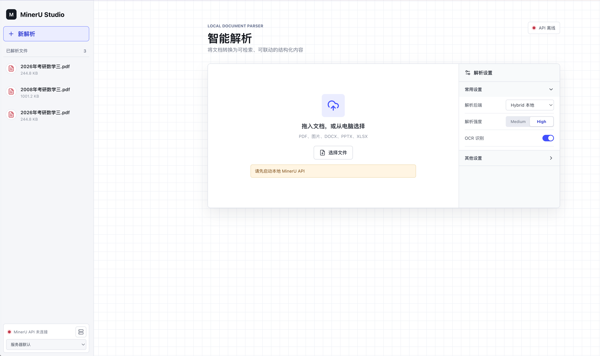
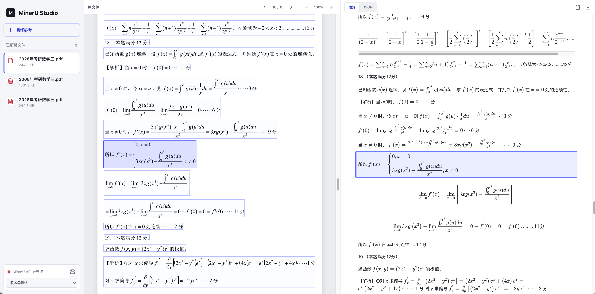

# MinerU Studio

连接本机 MinerU API 的文档解析界面，支持异步上传解析、历史记录、PDF 与结构化结果联动查看、保留原始 LaTeX 的内容块快捷复制，以及 Markdown、JSON 下载。

结构化渲染、分页、坐标高亮和 JSON 下载统一使用 `content_list_v2`，不依赖 `middle_json`。应用通过异步任务接口获取 ZIP 结果，再提取并持久化 `content_list_v2.json`。

## 界面预览

### 提交文件



### 解析结果



## 环境要求

- Node.js 20 及以上版本
- 本机已安装 MinerU 3.4.5，并可运行 `mineru-api`
- 模型已下载到本机

## 启动

首次使用先安装前端依赖：

```bash
npm install
```

同时启动 MinerU API、应用服务和前端开发服务器：

```bash
npm run dev:full
```

浏览器访问 <http://127.0.0.1:5173>。

如果 MinerU API 已经单独启动，只运行应用：

```bash
npm run dev
```

默认连接 `http://127.0.0.1:8000`。可通过 `MINERU_API_URL` 设置服务器默认地址，也可在左侧文件列表下方的“MinerU 服务”区域添加多个 IP/域名与端口并切换；页面配置和上次选择保存在浏览器中，每个任务会绑定提交时使用的地址。使用 `MINERU_STUDIO_DATA_DIR` 可指定解析记录目录。

解析设置分为默认展开的“常用设置”和默认折叠的“其他设置”。浏览器会记住上一次选择，新解析继续使用该配置；首次使用时解析强度默认为 High。OCR 语言仅在 Pipeline 后端显示并提交，其他后端不需要填写。ZIP 与 Content list v2 是必选输出；Markdown 和 Image 默认开启并可调整；Middle JSON、Model output 和 Original file 默认关闭。解析范围固定为全部页面，完成后可下载原始结果 ZIP。

已有 MinerU 识别结果无需重新发起任务。在首页切换到“导入结果”，可选择结果 ZIP，或选择该 ZIP 解压后的目录；结果中需同时包含原始 PDF 和 `_content_list_v2.json`，Markdown、图片、Middle JSON 和 Model output 可选。导入完成后会直接进入 PDF 与 OCR 内容联动预览，MinerU API 离线时也可使用。

## 验证与构建

```bash
npm run build
npm run typecheck:server
npm run lint
```

生产构建完成后，运行：

```bash
npm start
```

## 许可证

本项目采用 [MIT License](LICENSE)。
